# WorkshopTugas_Perpus UPDATE ONGOING

# WorkshopTugas_Perpus
WorkshopTugas_PerpusPro_by ##MaulanaSandy
## @maulana_sandy

# 🌐 PerpusPro

Website ini adalah aplikasi perpustakaan berbasis web dengan fitur CRUD, login user, peminjaman buku, dan dashboard admin. Dibuat dengan PHP Native dengan tampilan menarik, website ini sebenernya dibuat untuk memenuhi tugas workshop untuk mendapatkan sertfikat

## ✨ Fitur Utama

- 🔐 Autentikasi Login & Register
- 📚 Manajemen Buku (CRUD)
- 🔍 Fitur Search
- 👤 Manajemen Anggota
- 🔄 Peminjaman & Pengembalian Buku
- 📊 Dashboard Admin
- 🧾 Cek Laporan
- 🎨 Responsive Design

## 👩‍💼 Fitur Admin
- 📦 Manajemen Buku <br>
-> Tambah, edit, hapus buku

- Upload gambar sampul
- Atur stok

- 👥 Manajemen Anggota<br>
-> Tambah, edit, hapus data anggota

- 📑 Manajemen Peminjaman<br>
-> Buat transaksi peminjaman<br>
-> Atur tanggal pinjam dan batas pengembalian

- 🗃️ Manajemen Pengembalian<br>
-> Cek keterlambatan<br>
-> Hitung denda otomatis

- 💸 Laporan Denda<br>
-> Denda harian/total per anggota

- 📊 Laporan Perpustakaan<br>
-> Laporan buku paling sering dipinjam<br>
-> Laporan peminjaman bulanan/tahunan

- 🛡️ Manajemen Role<br>
-> Admin vs Anggota

## 🙋‍♀️ Fitur Anggota
- 🔓 Login & Profil<br>
-> Ubah password, lihat data diri

- 📚 Pinjam Buku (Request Online)

- 📬 Lihat Status Peminjaman

- ⏳ Notifikasi Deadline Pengembalian

- 💰 Lihat Total Denda

- 🌐 Katalog Buku Online

## ⚙️ Teknologi yang Digunakan

- PHP Native
- MySQL
- Bootstrap 5
- HTML 5
- JavaScript (Vanilla JS)
- FontAwesome
- Chart.js

## 🚀 Demo

[🔗 Lihat Live Demo](https://perpuspro-demo.infinityfreeapp.com/)  

## 🖼️ Screenshot

(dashboard, form login, dsb):

## Login Form
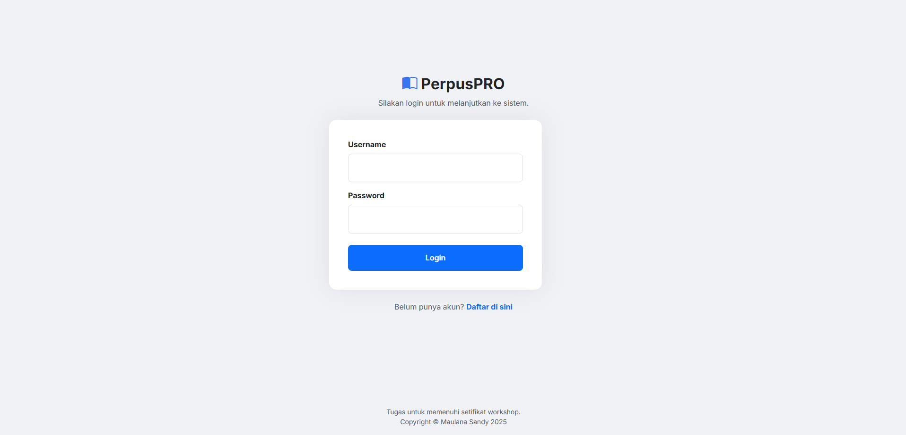

## Register
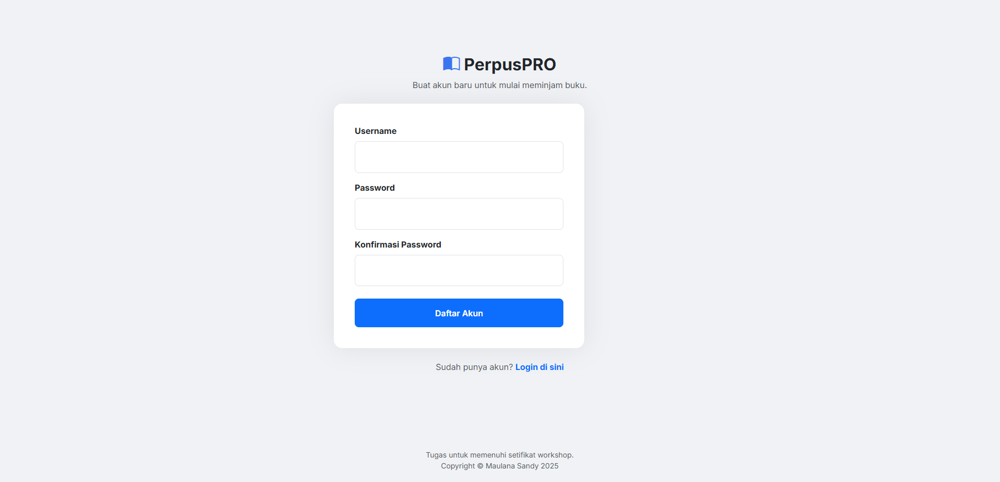

## Dashboard
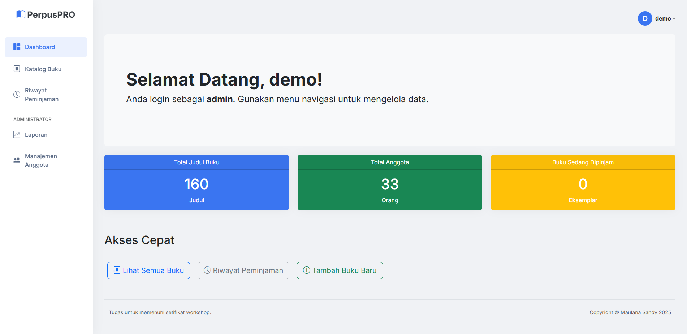

## Katalog Buku
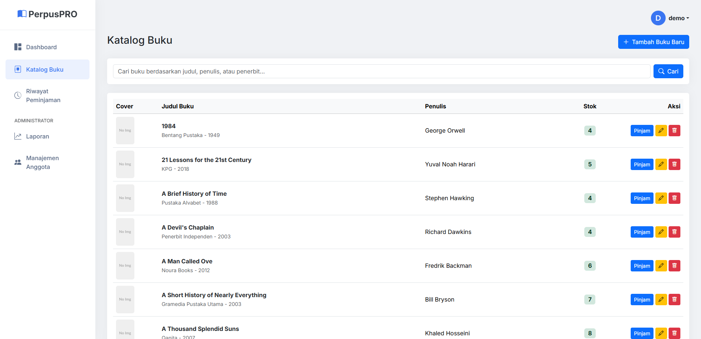
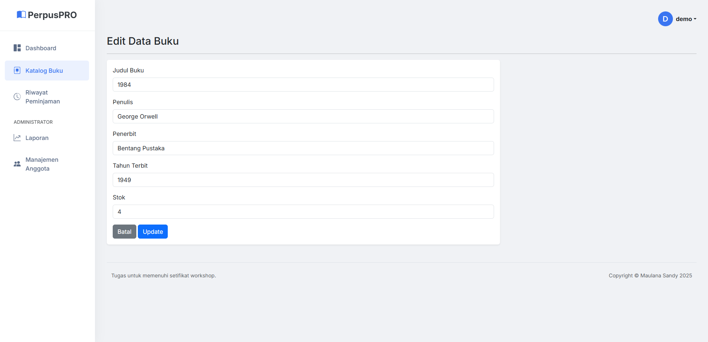

## Riwayat Peminjaman
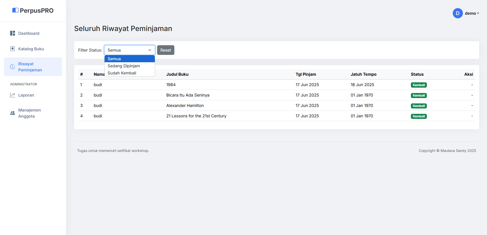

## Laporan
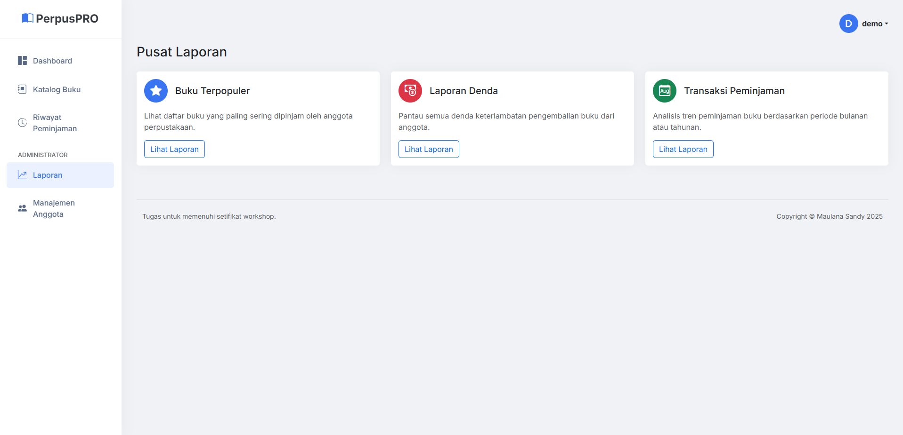
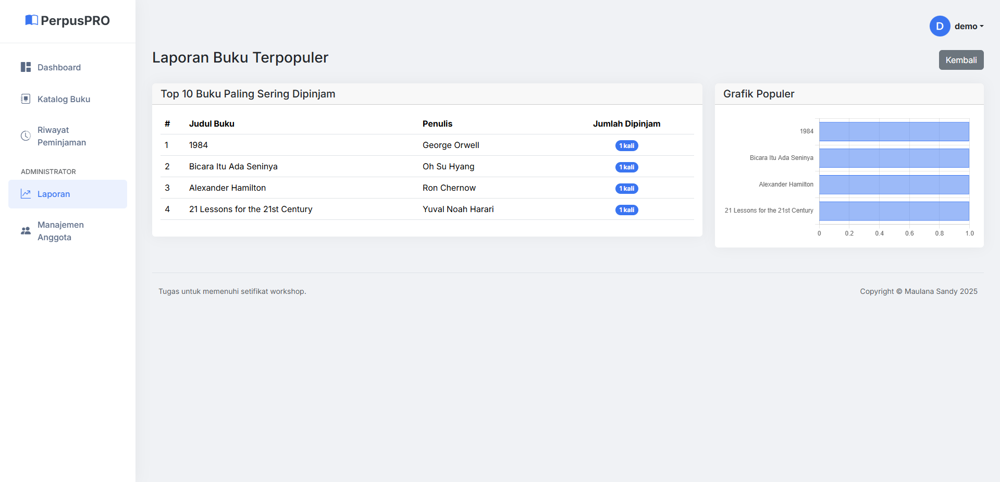
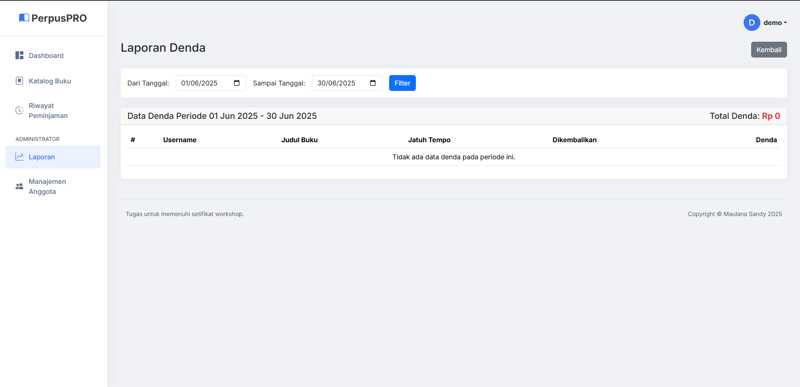
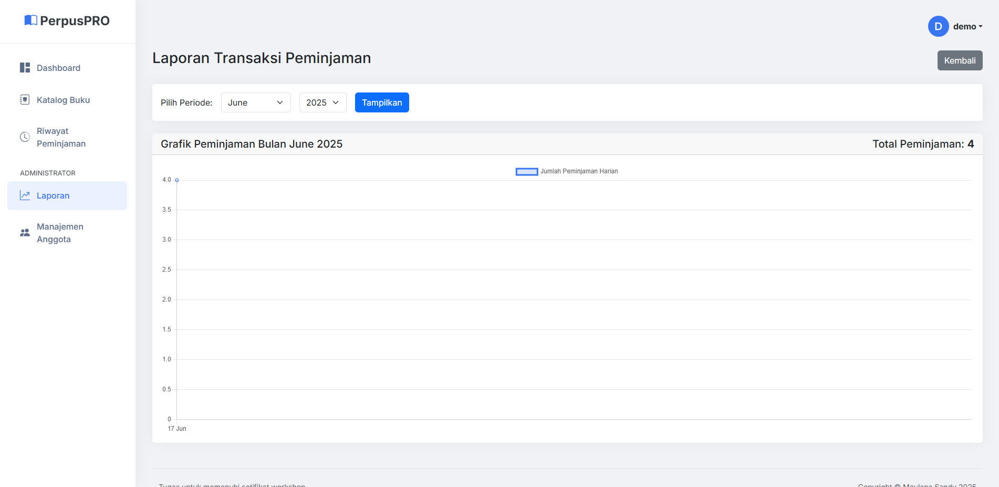

## Manajemen Anggota
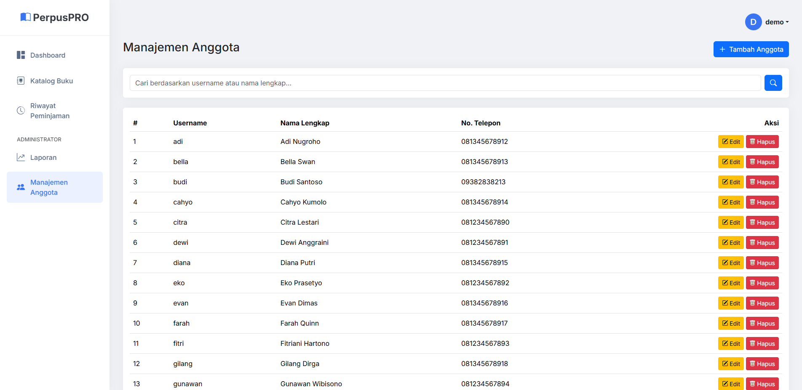
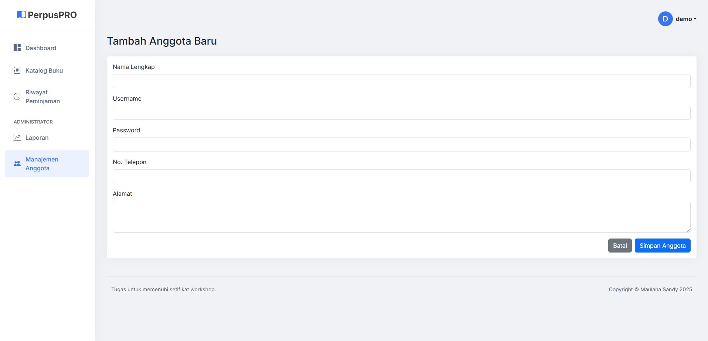
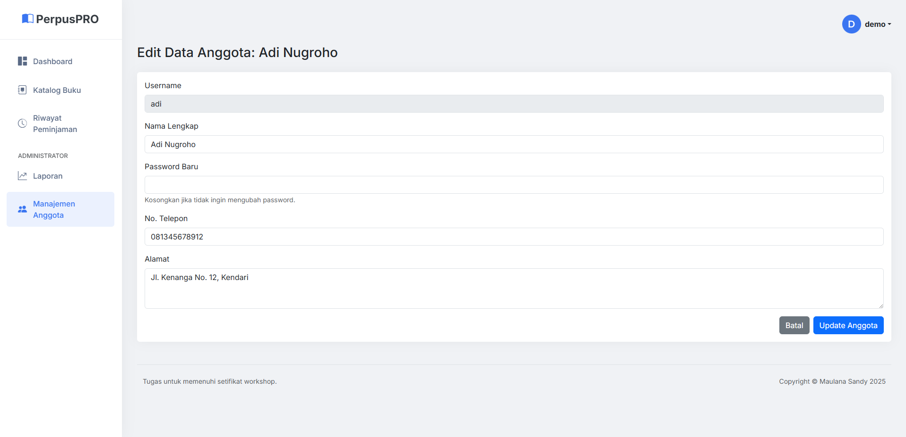

## 🛠️ Cara Install

1. Clone repo ini
```bash
git clone [https://github.com/MaulanaSandyy/WorkshopTugas_Perpus]

